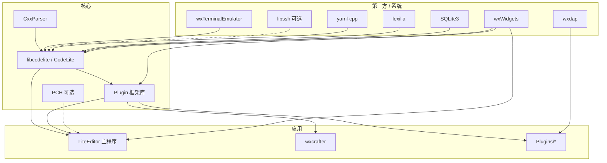

# CodeLite 架构（HarmonyOS PC 适配视角）

**源码**：`codelite/`  
**版本**：CMake 声明 `CODELITE_VERSION 18.5.0`  
**基线提交**：`6997f23`（`Update Workspace Build Configuration`）  
**语言 / 标准**：C++20 + wxWidgets（≥ 3.1.6）+ CMake ≥ 3.16

---

## 1. 一句话架构

CodeLite = **共享库内核（libcodelite）** + **插件框架（Plugin）** + **主程序（LiteEditor）** + **可选功能插件（Plugins/\*）**，全部架在 **wxWidgets** 上；进程、终端、平台探测等系统能力集中在 `CodeLite/` 内。

---

## 2. 顶层目录

| 目录 | 角色 |
|------|------|
| `CodeLite/` | 核心库 `libcodelite`：进程、平台、LSP、JSON、Socket、C++/PHP 解析辅助等 |
| `Plugin/` | 插件 SDK / 公共 UI 与服务（编译器探测、Debugger 管理、FileManager…） |
| `LiteEditor/` | 主可执行程序：工作区、编辑器、构建页、菜单/快捷键 |
| `Plugins/` | 可加载功能插件（LanguageServer、git、SFTP、Debugger、CMake…） |
| `CxxParser/` | C++ 解析相关 |
| `wxcrafter/` | UI 设计器相关（与主 IDE 同仓） |
| `sdk/` | `wxsqlite3`、`databaselayer` 等内嵌 SDK |
| `submodules/` | 第三方：lexilla、yaml-cpp、libssh、wxTerminalEmulator、wxdap、assistant… |
| `cmake/`、`scripts/`、`build.sh` | 构建与平台脚本 |
| `Runtime/` | 运行时资源 |
| `Interfaces/` | 接口头文件 |

---

## 3. 模块依赖图



**CMake 大致加入顺序**（摘自根 `CMakeLists.txt`）：

1. `submodules/lexilla` → `submodules` → `sdk/wxsqlite3` → `sdk/databaselayer` → `yaml-cpp`
2. `CxxParser` → `CodeLite` → `Plugin` →（可选 `PCH`）
3. `assistant` → `wxcrafter` → `Plugins`
4. 工具：`codelite_make` / `le_exec` / …
5. `LiteEditor`（主程序）→ `translations`

---

## 4. 运行时分层

```text
┌─────────────────────────────────────────┐
│  LiteEditor（主窗口 / 工作区 / 编辑器）   │
├─────────────────────────────────────────┤
│  Plugins/*（LSP、Git、Debugger、SFTP…）   │
├─────────────────────────────────────────┤
│  Plugin（公共对话框、CompilerLocator…）  │
├─────────────────────────────────────────┤
│  libcodelite                            │
│   · AsyncProcess  进程                   │
│   · Console       外置终端启动           │
│   · Platform      安装路径 / Which / PATH │
│   · LSP / Socket / JSON / Cxx…          │
├─────────────────────────────────────────┤
│  wxWidgets + OS（文件 / 剪贴板 / 窗口）   │
└─────────────────────────────────────────┘
```

---

## 5. 平台抽象（适配热点）

### 5.1 `ThePlatform`

`CodeLite/Platform/Platform.hpp`：

```cpp
#ifdef __WXMSW__
  #define ThePlatform MSYS2::Get()
#else
  #define ThePlatform LINUX::Get()   // 含 macOS 走 LINUX 实现的部分逻辑
#endif
```

能力（`PlatformCommon` / `LINUX`）：`FindInstallDir`、`FindHomeDir`、`Which`、`GetPath`、macOS `MacFindApp` 等。

**鸿蒙含义**：需要第三分支 `HARMONY`，或扩展 `LINUX` 覆盖鸿蒙路径/包管理/工具发现；不能假设 `/usr`、`apt`、`brew`。

### 5.2 进程 `AsyncProcess`

| 文件 | 平台 |
|------|------|
| `unixprocess_impl.*` / `UnixProcess.*` / `ZombieReaperPOSIX.*` | Unix |
| `winprocess_impl.*` | Windows |
| `ChildProcess.*` / `asyncprocess.*` | 统一接口 `IProcess` |

标志位含：`IProcessWrapInShell`、`IProcessNoPty`、`IProcessCreateSSH` 等。

**鸿蒙含义**：优先复用 Unix 实现；核对 `fork`/`forkpty`/`posix_spawn` 是否可用。

### 5.3 外置终端 `CodeLite/Console`

已有实现：CMD、Bash、Gnome/Konsole/Xfce、Alacritty、Kitty、OSX Terminal…  
**无 Harmony 后端** → Phase 4 新增 `clConsoleHarmony*`（或先复用 Bash 类 POSIX 终端）。

### 5.4 编译器探测 `Plugin/CompilerLocator`

已有：GCC、Clang、MSVC、MSYS2、Cygwin、Rustc、CrossGCC…  
鸿蒙需增加 **Harmony SDK / Clang 工具链 locator**。

### 5.5 调试

- 传统 Debugger 插件 + `DebugAdapterClient` + submodule `wxdap`
- CMake：`WITH_LLDB` 在 `UNIX` 默认开，可用 `-DENABLE_LLDB=0` 关闭

---

## 6. 主要 Plugins（可裁剪参考）

| 插件 | V1 建议 |
|------|---------|
| LanguageServer、CodeFormatter、git、CMakePlugin、Outline、WordCompletion、SmartCompletion | 保留 |
| Debugger、DebugAdapterClient | 保留（可先 DAP） |
| SFTP、Remoty、Docker | 可裁剪 |
| PHP*、Rust、SpellChecker、CallGraph、MemCheck、codelite_vim | 可后置 |
| abbreviation、SnipWiz、EditorConfig、ExternalTools、UnitTestCPP | 视首编情况 |

---

## 7. 外部依赖一览

| 依赖 | 必需性 | 说明 |
|------|--------|------|
| wxWidgets ≥ 3.1.6 | **必需** | GUI 根基；Linux 脚本走 GTK3 configure |
| CMake ≥ 3.16、Clang/GCC、C++20 | **必需** | |
| SQLite3 | **必需** | `find_package(SQLite3)` |
| bison / flex | **必需** | 词法/语法生成 |
| libssh | 可选 | `-DENABLE_SFTP=0` 可关 |
| LLDB | 可选 | `-DENABLE_LLDB=0` 可关 |
| GTK2/3 | Linux wx 路径需要 | 鸿蒙若非 GTK 后端则不走此路 |
| OpenSSL（assistant） | 视 assistant 开关 | 可后置 |

Submodules（部分）：`lexilla`、`yaml-cpp`、`zlib`、`libssh`、`hunspell`、`lua`/`LuaBridge`、`wxTerminalEmulator`、`wxdap`、`assistant`、`doctest`、`dtl`、`cc-wrapper`、`openssl-cmake`、`wx-config-msys2`、`agent-sop`。

---

## 8. 适配切入点清单（给 Phase 4）

1. `CodeLite/Platform/*` — 平台单例与路径  
2. `CodeLite/AsyncProcess/*` — 子进程与 PTY  
3. `CodeLite/Console/*` — Run/Debug 外置终端  
4. `Plugin/FileManager.*`、路径工具 — 文件 API  
5. `Plugin/CompilerLocator*` — SDK/编译器发现  
6. `Plugins/Debugger`、`Plugins/DebugAdapterClient` — 调试  
7. 根 `CMakeLists.txt` — 新 `OHOS`/`Harmony` 系统名、安装前缀、裁剪选项  
8. wxWidgets 后端 — **项目最大外部风险**

---

## 9. 相关文档

- 编译流程：`docs/build.md`
- 总体路线：`docs/roadmap.md`（V2：wx 独立阶段）
- 依赖裁剪：`docs/dependency.md`
- 平台扫描：`docs/platform.md`
- 第三方：`docs/thirdparty.md`
- 上游：`codelite/README.md`、`codelite/AGENTS.md`、`codelite/build.sh`
