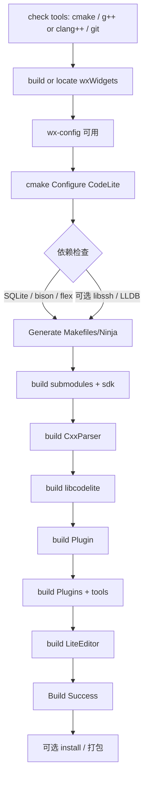

# CodeLite 编译流程（及 HarmonyOS PC 切入）

**上游入口**：`codelite/build.sh`、`codelite/CMakeLists.txt`  
**官方文档**：https://docs.codelite.org/build/build_from_sources/

---

## 1. 获取源码

```bash
cd ${PROJECT_ROOT}
git clone --depth 1 --recurse-submodules https://github.com/eranif/codelite.git
# 若已 clone 未拉子模块：
# cd codelite && git submodule update --init --recursive
```

当前基线：`6997f23`，版本 `18.5.0`。

---

## 2. 上游支持的三条构建路径

| 平台 | 生成器 / 要点 |
|------|----------------|
| Linux | `build.sh` → 自建 wx（GTK3 configure）→ `cmake` + `make`；可打 deb（`-DMAKE_DEB=1`） |
| macOS | `build.sh` → 自建 wx（CMake monolithic）→ `cmake` + `make` |
| Windows/MSYS2 | 需 `MSYS2_BASE`；`MinGW Makefiles`；`-DWXWIN=...` |

根 `CMakeLists.txt` 头部示例（Linux/macOS）：

```bash
mkdir build && cd build
cmake -G "Unix Makefiles" -DCMAKE_BUILD_TYPE=Release ..
make -j$(nproc) install
```

---

## 3. 编译流程图



### `build.sh` 内部逻辑（摘要）

1. `check_prerequistes`：编译器 + cmake + git  
2. 按 OS 调用 `build_wx_widgets_{Linux,macOS,MSW}`（默认克隆官方 wxWidgets 并安装到 `.build-release/wxWidgets-install`）  
3. `build_CodeLite_*`：用本地 `wx-config` 配置并编译 CodeLite  
4. 产物目录：通常 `codelite/.build-release`

---

## 4. CMake 关键选项

| 选项 | 作用 |
|------|------|
| `CMAKE_BUILD_TYPE` | Release / Debug / DebugFull |
| `WITH_WX_CONFIG` / `WITH_WXPATH` | 指定 wx-config |
| `WXWIN` | Windows 下 wx 根目录 |
| `COPY_WX_LIBS` | 拷贝 wx 库到输出 |
| `WITH_PCH` | 预编译头 |
| `ENABLE_SFTP=0` | 关闭 SFTP/libssh |
| `ENABLE_LLDB=0` | 关闭 LLDB |
| `BUILD_TESTING` | 测试目标（默认 OFF） |
| `MAKE_DEB` / RPM 相关 | 打包 |
| `PHP_BUILD` | PHP 专用裁剪（会 `DISABLE_CXX`） |
| `CMAKE_INSTALL_PREFIX` / `CL_PREFIX` | 安装前缀 |

**依赖硬要求**：SQLite3、BISON、FLEX；找不到则 `FATAL_ERROR`。

---

## 5. 目标产物（逻辑顺序）

```text
lexilla / submodules / wxsqlite3 / databaselayer / yaml-cpp
    → CxxParser
    → libcodelite          (CodeLite/)
    → Plugin               (插件框架库)
    → assistant / wxcrafter
    → Plugins/*            (各功能 .so/.dll)
    → codelite_make 等工具
    → LiteEditor           (主程序 codelite)
    → translations
```

安装布局（Unix 典型）：

- 二进制：`${PREFIX}/bin`
- 插件：`${PREFIX}/lib/codelite`（或 `lib64`）
- 资源：`${PREFIX}/share/codelite`

---

## 6. HarmonyOS PC 建议流程（路线 V2）

> 总序：Toolchain → **wxWidgets** → libcodelite → LiteEditor → Project/Build。详见 `docs/roadmap.md`。

### 6.1 阶段目标拆分

| 阶段 | 命令级判据 |
|------|-----------|
| Phase 2 | **Exit Criteria ×5 全过**（找 Clang → hello 编译 → hello 运行 → CMake 最小工程 → 产出 `harmonyos-pc.cmake`）；详见 `docs/roadmap.md` / `toolchain/README.md` |
| Phase 3 | wxWidgets 最小窗口样例成功 |
| Phase 4 | `libcodelite` **Build Success** |
| Phase 5 | `LiteEditor` 链接并启动主窗口 |

### 6.2 推荐首配（缩小失败面）

```bash
# 伪代码：待 toolchain/harmonyos-pc.cmake 落地后替换
cmake -S codelite -B build-harmony \
  -G Ninja \
  -DCMAKE_BUILD_TYPE=Release \
  -DCMAKE_TOOLCHAIN_FILE=toolchain/harmonyos-pc.cmake \
  -DWITH_WX_CONFIG=/path/to/harmony-wx-config \
  -DENABLE_SFTP=0 \
  -DENABLE_LLDB=0 \
  -DBUILD_TESTING=OFF \
  -DWITH_PCH=0
```

### 6.3 工具链目录（Phase 2 交付）

```text
toolchain/
  README.md                 # SDK 安装与环境说明
  harmonyos-pc.cmake        # CMAKE_C_COMPILER / sysroot / find 根路径
  env.sh                    # export PATH、OHOS_SDK_HOME 等
```

### 6.4 阻塞项检查表

- [ ] HarmonyOS PC SDK + Clang 可用  
- [ ] CMake 能识别目标系统（可能需补 `CMAKE_SYSTEM_NAME`）  
- [ ] **wxWidgets 已为鸿蒙编过，且 wx-config 可用**  
- [ ] SQLite3 / bison / flex 在 sysroot 或 host 策略明确  
- [ ] 是否提供 GTK 或其它 wx 后端  

---

## 7. 本机（macOS 开发机）现状备忘

用于文档/分析的宿主机快照（非鸿蒙目标环境）：

| 工具 | 状态 |
|------|------|
| git | 有（2.50.1） |
| clang++ | 有 |
| cmake | **未安装**（Phase 2 前需补齐，或只在鸿蒙 SDK 环境构建） |

上游 Linux/macOS 一键脚本：`cd codelite && ./build.sh`（会拉 wx 并编译，耗时长）。

---

## 8. 常见失败与对应阶段

| 现象 | 通常阶段 | 处理方向 |
|------|---------|---------|
| `wx-config` / wxWidgets not found | 2 | 先独立编 wx |
| `Could not find sqlite3` | 2 | 装开发包或指 sysroot |
| bison/flex not found | 2 | 安装或指定路径 |
| missing header / fatal error | 3 | 补头文件路径或 `#ifdef` |
| undefined reference | 3 | 补库、关插件、修平台 stub |
| 运行后终端/调试崩溃 | 4–6 | AsyncProcess / Console / DAP |

---

## 9. 相关文档

- 架构与适配热点：`docs/architecture.md`
- 总体路线：`docs/roadmap.md`
