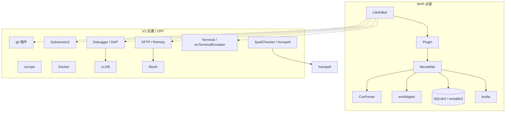

# CodeLite 依赖关系（裁剪用）

**目的**：一眼看出「关什么 / 留什么」，服务 MVP 与首编。  
**基线**：`codelite/` @ `6997f23`（18.5.0）

---

## 1. 分层依赖（主链）

```text
LiteEditor          ← 主程序（MVP 终点）
    ↓
Plugin              ← 插件框架 / 公共 UI / CompilerLocator / FileManager
    ↓
libcodelite         ← 进程、平台、路径、JSON、LSP 客户端基础设施…
    ↓
CxxParser           ← C++ 解析（工程/索引相关会用到）
    ↓
sdk / submodules    ← wxsqlite3、lexilla、yaml-cpp…
    ↓
wxWidgets           ← GUI / 事件 / 文件对话框（关键）
    ↓
系统库              ← libc++、pthread、SQLite3、（可选）libssh / LLDB
```

工具链（运行期发现，非链接必依赖）：

```text
clang / g++ / make / ninja / ctags（外置）
```

---

## 2. 模块依赖图（可裁剪视角）



---

## 3. 目标级依赖（CMake 顺序）

| 顺序 | 目标 | 依赖谁 | MVP |
|------|------|--------|-----|
| 1 | lexilla / yaml-cpp / wxsqlite3 / databaselayer | 系统 + wx | 要（yaml 可评估） |
| 2 | CxxParser | — | 要 |
| 3 | libcodelite | wx、SQLite、上表 sdk | **要** |
| 4 | Plugin | libcodelite、wx | **要** |
| 5 | Plugins/* | Plugin | 绝大多数 **OFF** |
| 6 | LiteEditor | Plugin、libcodelite | **要** |
| 7 | wxcrafter / assistant / translations | — | OFF / 后置 |

---

## 4. 插件依赖与裁剪表

来源：`Plugins/CMakeLists.txt`。

| 插件 | 依赖倾向 | MVP |
|------|----------|-----|
| （无插件）仅 LiteEditor 核心工程/构建 UI | Plugin / libcodelite | **ON** |
| CMakePlugin / Gizmos（向导） | C++ 工程 | 建议 ON（Project） |
| LanguageServer / WordCompletion / SmartCompletion | LSP | 后置 |
| git | 外置 git | **OFF** |
| Subversion2 | svn | **OFF** |
| SFTP / Remoty | libssh | **OFF**（`-DENABLE_SFTP=0`） |
| Debugger / DebugAdapterClient / gdbparser | gdb/DAP/LLDB | **OFF** |
| cscope / SpellChecker / Docker / MemCheck | 外置工具 | **OFF** |
| PHP* / Rust / CallGraph / codelite_vim / … | 语言/增强 | **OFF** |
| AutoSave / EditorConfig / abbreviation / CodeFormatter | 轻量 | 可后开 |

---

## 5. MVP 推荐关闭开关

```bash
-DENABLE_SFTP=0          # 关 SFTP + Remoty + libssh 硬依赖
-DENABLE_LLDB=0          # 关 LLDB
-DBUILD_TESTING=OFF
# 另需在 CMake/补丁中跳过 Plugins 批量 add_subdirectory
# 目标：只编 libcodelite + Plugin + LiteEditor（+ 最少工程插件）
```

**第一版功能面（认可的最小集）**

```text
LiteEditor + Project + Build
```

明确不做：Debugger、SFTP、SVN、Cscope、SpellCheck、Terminal、Git GUI。

---

## 6. 和编译阶段的对应

| 验证台阶 | 证明什么 |
|----------|----------|
| hello.cpp | 工具链 |
| wxWidgets | GUI 根基 |
| libcodelite | 内核 + 平台抽象 |
| Plugin + LiteEditor | 可出现主窗口 |
| Project + Build | MVP 可用 |

详见 `docs/roadmap.md` Phase 2 分步。
